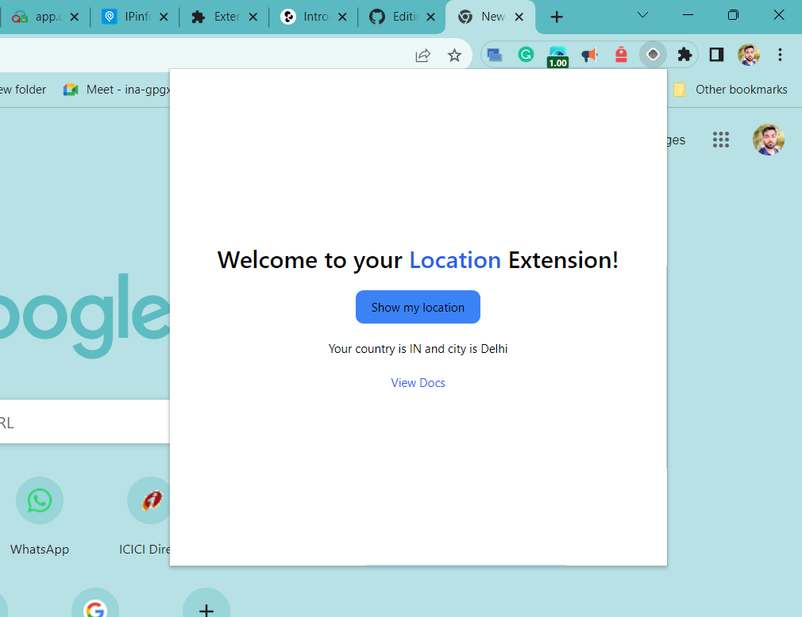

# Location Chrome Extension

## Overview

Welcome to the Location Chrome Extension! This extension allows you to easily retrieve and display your country and city based on your IP address. With a clean and user-friendly design, you can access your location information with just a click.

## Functionality

- Click the Chrome extension icon to open the popup.
- The popup displays a centred button with the text "Show my location."
- When you click the button, it enters a loading state while your location is being determined.
- Once the location is fetched, it displays your country and city in a formatted message.
- If there is an error in fetching the location, it displays an error message.
- You can also access the link to Plasmo documentation for more information.

## How It Works

1. The extension makes use of the IPify API to fetch your IP address.
2. The IP address is then used to call the ipinfo.io API to get your country and city information.
3. The fetched data is displayed in the popup interface using React and styled with Tailwind CSS.

## Installation

1. Clone the repository.
2. Install dependencies using `pnpm install`.
3. Rename the `.env.example` file to `.env` and replace `YOUR_IPINFO_TOKEN` with your actual IPinfo access token.

## Usage

1. Click on the Chrome extension icon to open the popup.
2. Click the "Show my location" button to retrieve and display your country and city.

## Video Demonstration

[Watch the Video](https://drive.google.com/file/d/1OjQLQbeP21V0LgNivZF79t5jk0GhNn5T/view?usp=drivesdk)

## Contributing

Contributions are welcome!
